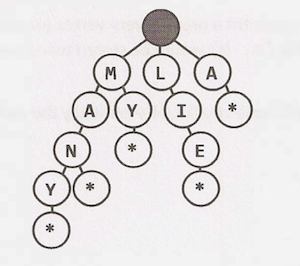

# Trie

A Trie or Prefix Tree is a data structure that is 
used for efficiently searching prefixes of words. It is a n-ary
tree where each node represents a letter in a word and is
connected to the next letter in a possible word. 
When a complete word is formed, that node is marked as a terminal
node (shown in the diagram using "*"). The maximum number of children
is the number of letters in the english alphabet, 26, assuming
we are indexing only english words.

This tree enables quick prefix queries, but largely operates
similar to a hash table. It takes O(K) time to search the trie
where k is the length of the search string. Inserting a new string
also takes O(K) time.

Here's a picture of a Trie

